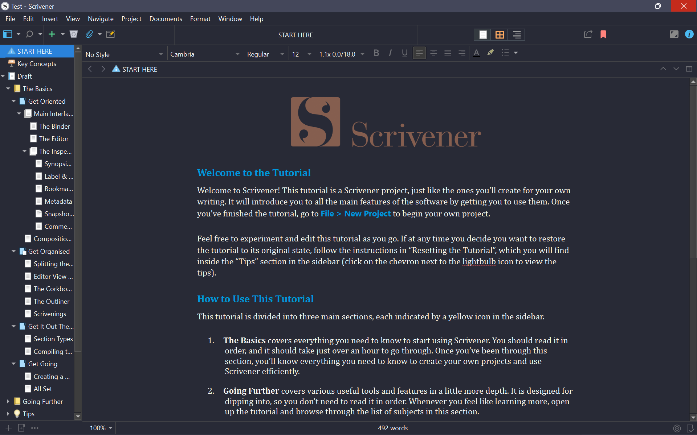

# Dracula for [Scrivener](https://www.literatureandlatte.com/scrivener/overview)

> A dark theme for [Scrivener](https://www.literatureandlatte.com/scrivener/overview).

## Install

All instructions can be found at [draculatheme.com/x](https://draculatheme.com/scrivener).

## Team

This theme is maintained by the following person(s) and a bunch of [awesome contributors](https://github.com/dracula/template/graphs/contributors).

 |
--- |
[Zeno Rocha](https://github.com/zenorocha) |
 |
--- |
[Ayush Pokharel](https://github.com/ayushpokh) |
## License

[MIT License](./LICENSE)
